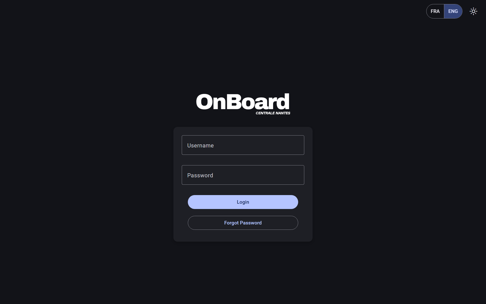
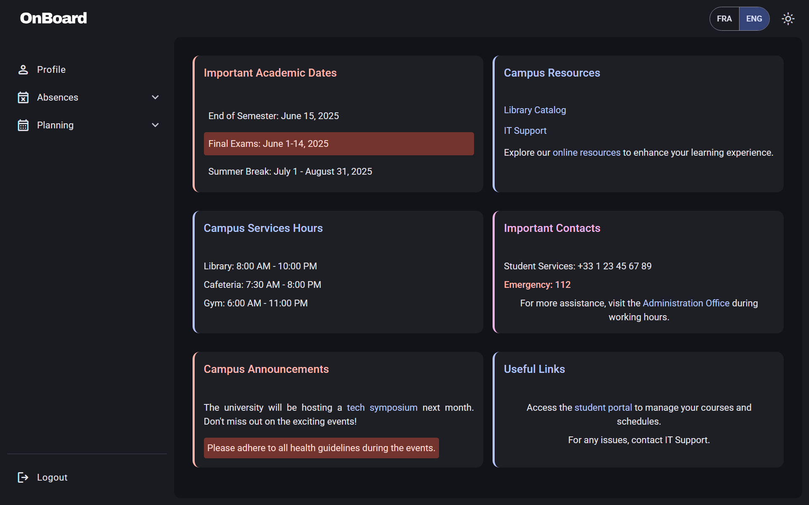
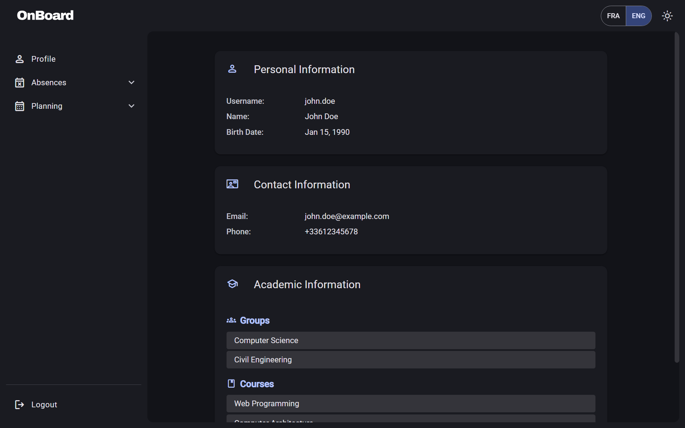
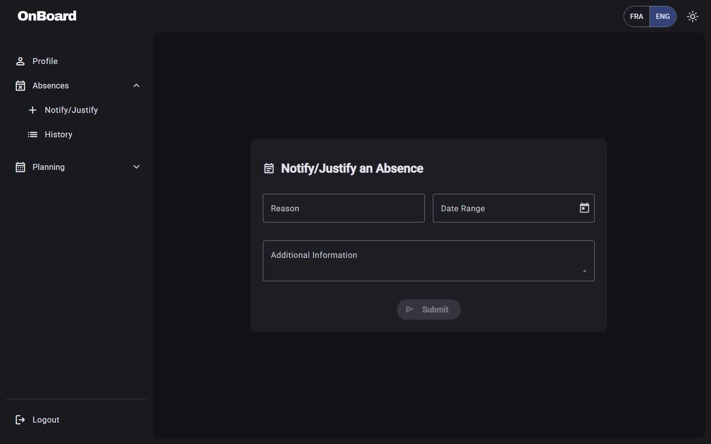
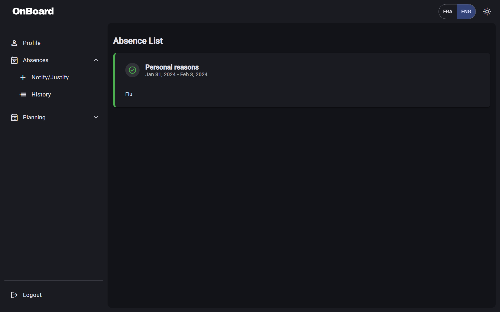
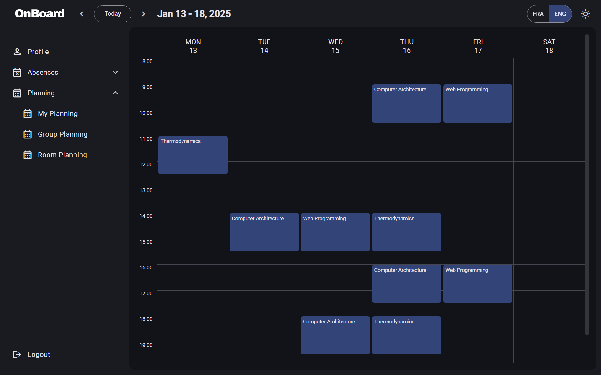
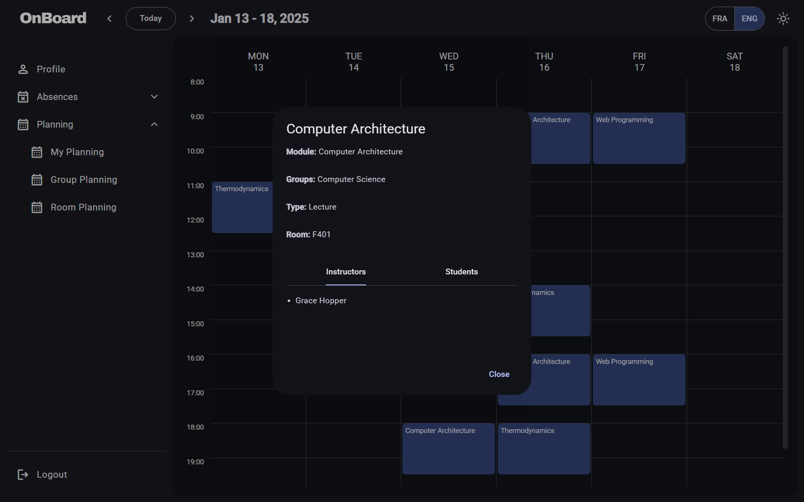
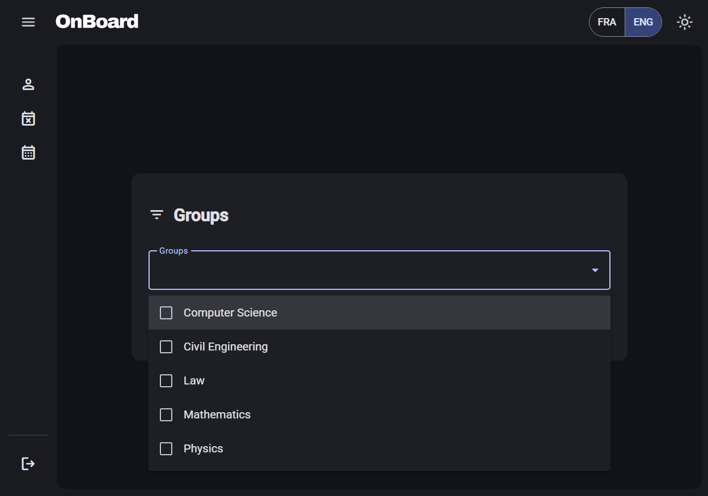
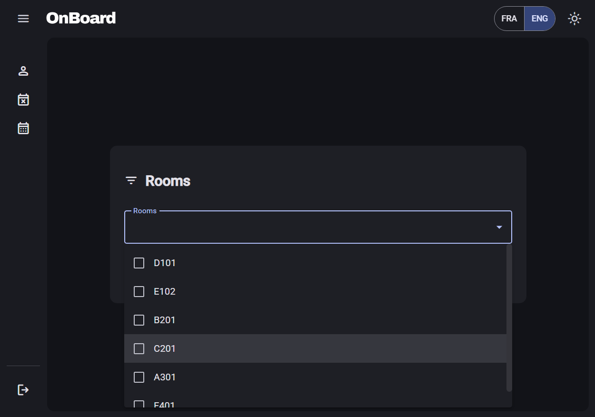

# Onboard 2024 

Onboard 2024 is a redesigned and reimplemented version of the existing [academic platform](https://onboard.ec-nantes.fr/) of Ecole Centrale de Nantes, designed to provide students with easy access to various academic and administrative resources. 

The platform allows users to manage their profiles, view their schedules, submit and track absences, and access important announcements. 

The application also features a responsive design with a modern interface, a dark mode, and fully supports internationalization.

## Features

- **Profile Management**: View and update personal and academic information.
- **Planning**: Access personal, group, and room schedules.
- **Absences**: Submit and track absence notifications and justifications.
- **Announcements**: Stay updated with important campus announcements.
- **To Be Implemented**: Access to administrative resources, grades, and more.

## Pages

### Login
The login page allows users to authenticate and access the portal.



### Home
The home page provides an overview of important academic dates, campus resources, service hours, and announcements.



### Profile
The profile page displays personal and academic information, including contact details and the groups the user belongs to.



### Absences
The absences page enables users to submit and track absence notifications and justifications.




### Planning
The planning page allows users to view their schedules.




It is also possible to view the schedules of specific groups and rooms.





## Setup Instructions

### Prerequisites

- **Node.js**: Ensure you have Node.js installed. You can download it from [nodejs.org](https://nodejs.org/). Node.js will also install npm, which is the package manager for Node.js.

- **Angular CLI**: Install Angular CLI globally using npm. The version used for this project is 18.2.5.
    ```bash
    npm install -g @angular/cli
    ```
- **NestJS CLI**: Install NestJS CLI globally using npm. The version used for this project is 10.4.5.
    ```bash
    npm install -g @nestjs/cli
    ```
- **PostgreSQL**: Ensure you have PostgreSQL installed and running. You can download it from [postgresql.org](https://www.postgresql.org/).

### Download and Install

1. **Clone the repository**:
     ```bash
     git clone https://github.com/Kiboya/onboard-2024.git

     cd onboard-2024
     ```

2. **Install dependencies for the frontend**:
     ```bash
     cd onboard_2024_front
     npm install
     ```

3. **Install dependencies for the backend**:
     ```bash
     cd ../onboard_2024_back
     npm install
     ```

### Configuration

1. **Configure PostgreSQL**:
     - Create a PostgreSQL database.
     - Update the database connection settings in `onboard_2024_back/.env` file.
Here are the variables to update:
     ```bash
     DB_USER='postgres'
     DB_HOST='localhost'
     DB_PORT='5432'
     DB_PASSWORD=your_password
     DB_NAME=your_database_name
     ```

1. **Run the backend**:
     ```bash
     cd onboard_2024_back
     npm run start
     ```

2. **Run the frontend**:
     ```bash
     cd ../onboard_2024_front
     ng serve
     ```

3. **Access the application**:
     Open your browser and navigate to `http://localhost:4200/`.

## Further Help

For more help, you can refer to the official documentation of [Angular](https://angular.io/docs), [NestJS](https://docs.nestjs.com/), and [TypeORM](https://typeorm.io/#/).
